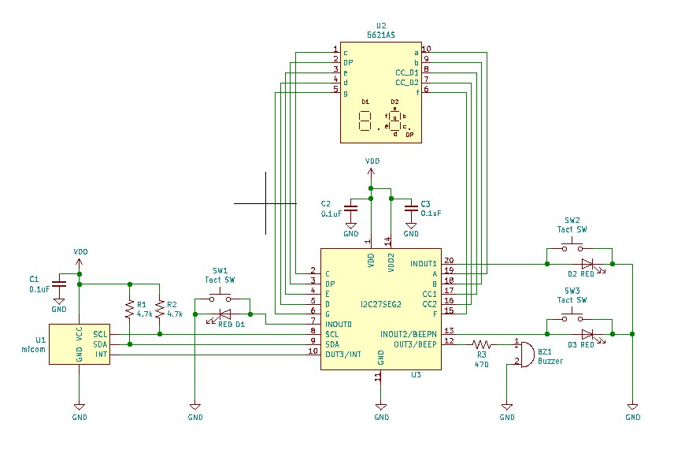

# I2C to 7SEGx2 , Beep , GPIO and input interrupt using GreenPAK. (緑豆壱拾捌號)  
  
GreenPAK用のデザインデータです。  
I2Cインタフェースで2桁7セグメントLEDの制御を可能にします。  
同時にBeep、GPIO、入力信号割込みをサポートします。  
SLG46826V(STQFN) または SLG46826G(TSSOP) に対応しています。   
SLG46826V-DIPに焼くこともできます。   

  

## 機能
- I2Cで2桁7セグメントLED の任意セグメントをON/OFF可能  
- セグメント制御端子を10kΩのPull-up抵抗でドライブしているので、LEDを直結可能  
- ３個のGPIO端子（INOUT0,1,2)と２個のGPO端子（OUT3,4)が利用可能  
- GPIO端子入力の1/0変化を検出するINT（割り込み）出力機能を装備（OUT3との切り替え）  
- 任意周波数のON/OFF信号を発生するBEEP出力機能を装備（OUT4との切り替え）  
- GPO端子は10kΩ Pull-up抵抗を内蔵しているので、LEDを直結可能  
- GPIO端子は10kΩ Pull-up抵抗を内蔵しているので、スイッチやLEDを直結可能  

## 応用回路図
### 設計内容
- 2桁7セグメントLEDの任意セグメント制御に対応
- LEDつきスイッチ３個の入力に対応
- INT（割り込み）出力に対応
- Beep出力に対応

  

### 設計内容の補足
- LEDを明るくしたい場合は、外部に数kΩのプルアップ抵抗をつけるか、セグメント制御端子の属性をopen drainからpush pullに変更して外部で数kΩの電流制限抵抗を挟んでください。  

## 組み立て例
デバッグ用にブレッドボード上に実装した例。（マイコンは省略）　
DIP版GreenPAKにかぶせるように7SEGモジュールを挿すことで、配線を最少化してみた。  
内蔵抵抗を最大限利用して基板上は抵抗レス。内蔵抵抗だとLEDはちょっと暗い。  

  

## ピンアサイン
ピン配置は2桁7セグメントLED 5621AS（カソードコモン） 向けに設計してあります。  

### I2C27SEG 
STQFN Pin # | TSSOP Pin # | 機能名 | IO | 内蔵抵抗 | SLG46826端子名 | 機能
--- | --- | --- | --- | --- | --- | ---
1 | 20 | VDD |  |  | VDD |  2.3V～5.5V
2 | 19 | C | O | PU10k | IO0 | segment
3 | 18 | DP | O | PU10k | IO1 | segment
4 | 17 | E | O | PU10k | IO2 | segment
5 | 16 | D | O | PU10k | IO3 | segment
6 | 15 | G | O | PU10k | IO4 | segment
7 | 14 | INOUT0 | I/O | PU10k | IO5 | GPIO
8 | 13 | SCL | I | - | SCL | SCL for SLG46826
9 | 12 | SDA | I/O | - | SDA | SDA for SLG46826
10 | 11 | OUT3/INT | O | PU10k | IO6 | GPO or INT
11 | 10 | GND |  |  | GND |  GND
12 | 9 | OUT4/BEEP | O | PU10k | IO7 | GPO or BEEP
13 | 8 | INOUT2 | I/O | PU10k | IO8 | GPIO or BEEP
14 | 7 | VDD2 |  |  | VDD2 |  2.3V～5.5V
15 | 6 | F | O | PU10k | IO9 | segment
16 | 5 | CC2 | O | PU10k | IO10 | Common cathode 2
17 | 4 | CC1 | O | PU1M | IO11 | Common cathode 1
18 | 3 | B | O | PU10k | IO12 | segment
19 | 2 | A | O | PU10k | IO13 | segment
20 | 1 | INOUT1 | I/O | PU10k | IO14 | GPIO

### 内蔵抵抗
各端子の内蔵抵抗を有効にしていますので、外付け抵抗を省略できます。  
記号はおおよその抵抗値を表しており、値は以下の通りです。  
- PU10k: Pull-up 10k ohm  
- PU1M: Pull-up 1M ohm  
  
## コントロールレジスタ
I2Cアドレスは、0x08～0x0Fです。  
※I2Cアドレスを変更するには設計ツールでI2Cのプロパティを書き換えてください。  
I2Cアドレス0x08のI2Cレジスタを書き換えることでデバイスの動作を制御できます。  
I2Cアドレス0x09~0x0Fは回路書換用に予約されていますので、不用意にアクセスを行わないでください。  
  
### コントロールレジスタ一覧
レジスタ一覧を下記に示します。  
  
address | W/R | default| bit | Definition 
--- | --- | --- | ---| ---
0x74 | R | -- | [7]	 | INOUT1 input value 0: Low, 1: High
 | | | | [6] |INOUT0 input value 0: Low, 1: High
 | | | | [5:0] | *Reserve*
0x75 | R | -- | [7:6] | *Reserve*
 | | | | [5] | INOUT2 input value 0: Low, 1: High
 | | | | [4:0] | *Reserve*
0x7A | W | 0x00 | [7] | OUT4 port mode select  0:Normal mode, 1:Interrupt flag mode
 | | | | [6:5] | OUT3 and INOUT2 port mode select  00:Normal mode 01:Beep mode use OUT3 10:Beep mode use INOUT2 11:Beep mode use OUT3 and INOUT2 (Differential) 
 | | | | [4] | OUT4 port control IF Normal mode  0:output Low, 1:output & Pull-up IF Interrupt flag mode   0→1 or 1→0 toggle for reset 
 | | | | [3] | OUT3 port control IF Normal mode  0:output Low, 1:output & Pull-up IF Beep mode  0:Beep OFF, 1:Beep ON
 | | | | [2] | INOUT2 port control IF Normal mode  0:input & Pull-up, 1:output Low IF Beep mode  0:Beep OFF, 1:Beep ON
 | | | | [1] | INOUT1 port control  0:input & Pull-up, 1:output Low
 | | | | [0] | INOUT0 port control  0:input & Pull-up, 1:output Low
0x92 | W | 0x00 | [7:0] | 7segment data for digit1 [7]: A [6]: B [5]: C [4]: D [3]: E [2]: F [1]: G [0]: D.P
0x93 | W | 0x00 | [7:0] | 7segment data for digit2 [7]: A [6]: B [5]: C [4]: D [3]: E [2]: F [1]: G [0]: D.P
0xA5 | W | 0x5D | [7:0] | Beep frequency data. Default: 440Hz data = 25000000/4/frequency[Hz]-2  data[7:0]
0xA6 | W | 0x34 | [7:0] | Beep frequency data  data[15:8]
0xC8 | W | 0x00 | [7:0] | Software reset 0x02:reset
    
## INT
レジスタ 0x7A[7] に1を設定することで、OUT4端子からINT（割り込み）を出力します。  
入力に設定されたGPIO端子の入力値が変化するとHighを出力し、High状態を維持します。  
レジスタ 0x7A[4] の値を書き換えることで、Lowに戻すことができます。  
（前回の値が0なら1を書く、前回の値が1なら0を書く）   
マイコンの割り込み端子やWakeUp端子に接続する使い方を想定しています。  

## BEEP
圧電スピーカーをつなぐことで音を出すことができます。  
レジスタ 0x7A[6] に1を設定することで、OUT3端子をBEEP端子に切り替えます。  
この時、レジスタ 0x7A[3] でOUT3端子のBEEP出力をON/OFFすることができます。
レジスタ 0x7A[5] に1を設定することで、INOUT2端子からBEEP信号を出力します。  
この時、レジスタ 0x7A[2] でINOUT2端子のBEEP出力をON/OFFすることができます。
OUT3端子とINOUT2端子の間に圧電スピーカを繋ぎ、両方の端子をBEEP端子とすることでより大きい音を出すことができます。この時、レジスタ 0x7A[3:2] の設定値で音量を切り変えることもできます。

レジスタ 0xA5[7:0], 0xA6[7:0] で周波数を変更することができます。初期値は440Hzです。  
設定値は、25000000/4/周波数(Hz)-2 を計算し、結果を16ビットとして下位8ビットをレジスタ 0xA5[7:0] に、上位8ビットを 0xA6[7:0] に設定します。  
周波数はあまり正確ではありません。  

## GPO
OUT3, OUT4  
Normal modeの端子では、コントロールレジスタを設定することで、GPOの出力信号をLow出力、またはPull-up出力にすることができます。  
通常のLow/High出力として使えるほか、LEDをつなぎ反対側をGNDにつなぐことでLEDのON/OFFが可能です。（1で点灯）  
  
### 使用例１
GPO端子を他のICの入力端子につなぐ。  
- 初期状態または0を設定するとLOW出力、1を設定するとHigh出力となる。  

### 使用例２ 
GPO端子にLEDをつなぎ、LEDの反対側をGNDにつなぐ。  
- 初期状態ではLEDが消灯する。  
- レジスタに1を設定すると、LEDが点灯する。  
- レジスタに0を設定すると、LEDが消灯する。

## GPIO
INPUT0, INOUT1, INOUT2  
Normal modeの端子では、コントロールレジスタを設定またはリードすることで、GPIOを用いた入出力を行えます。  
0を設定すると、入力かつPull-up、1を設定するとLowを出力するように動作します。  

### 使用例１
GPIO端子を他のICの入力端子につなぐ。  
- 初期状態または0を設定するとHigh出力、1を設定するとLow出力となる。（負論理であることに注意）  

### 使用例２
GPIO端子にLEDをつなぎ、LEDの反対側をGNDにつなぐ。  
- 初期状態ではLEDが点灯する。  
- レジスタに1を設定すると、LEDが消灯する。  
- レジスタに0を設定すると、LEDが点灯する。（負論理であることに注意）  

### 使用例３ (使用イメージ参照）
GPIO端子にプッシュスイッチとLEDをつなぎ、スイッチとLEDの反対側をGNDにつなぐ。  
- 初期状態ではLEDが点灯する。  
- 初期状態またはレジスタに0を設定したときは、プッシュスイッチの状態をリードすることができる。また、スイッチを離している間はLEDが点灯し、スイッチを押している間はLEDが消灯する。  
- レジスタに1を設定すると、スイッチ入力が無効化されINTに反映されなくなる。また、LEDが常時消灯となる。

## ソフトウェアリセット
コンフィギュレーションレジスタのアドレス0xC8に0x02を書き込むことで、SLG46826にリセットをかけることができます。  
リセット後はSLG46826が初期化され、端子設定やレジスタ設定などが初期状態に戻ります。  
リセット状態は自動的に解除されるので、0x00を送りなおす必要はありません。  
  
## 設計データ
「GreenPAK6 Designer」で  
I2C27SEG2.gp6  
を開き、SLG46826V またはSLG46826Gに焼いてください。  
プルアップ／プルダウン抵抗、ドライブ能力などはお好きに変更して下さい。  
SLG46826G に焼く場合は、File-Project info で Packageを「TSSOP-20」に変更してください。この場合、LEDと端子の対応が左右反転しますが、ピッチ変換基板を裏返しに使うなどSLG46826Gを左右反転にすることで、設計データをそのまま使うことができます。  

設計データ外観  
  

## 免責事項
当方は、利用者に対して、このデザインおよびこの資料（以下、本デザイン等）に関する当方または第三者が有する著作権、特許権、商標権、意匠権及びその他の知的財産権をライセンスするものではありませんし、本デザイン等の内容についていかなる保証をするものでもありません。また当方は、本デザイン等を用いて行う一切の行為について何ら責任を負うものではありません。本デザイン等の情報の利用、内容によって、利用者にいかなる損害、被害が生じても、当方は一切の責任を負いません。ご自身の責任においてご利用いただきますようお願いいたします。   
  
  
## Author  
[GitHub/AoiSaya](https://github.com/AoiSaya)  
[Twitter ID @La_zlo](https://twitter.com/La_zlo)  
